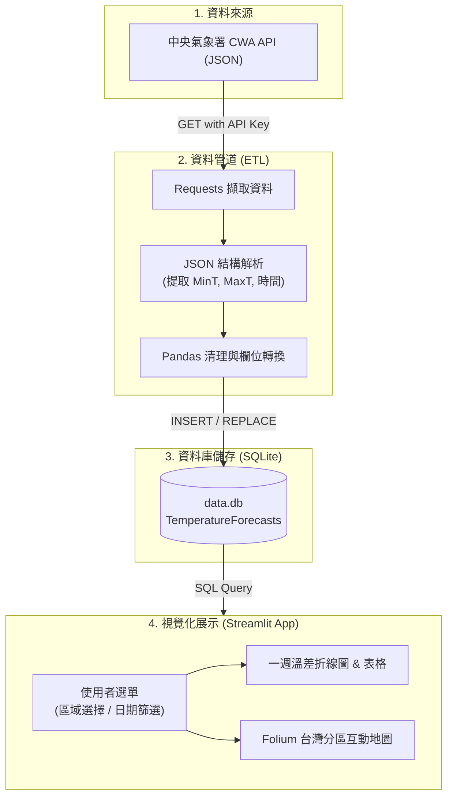

# 🌦️ 台灣天氣預報互動儀表板 (Taiwan Weather Forecast Dashboard)

[](https://www.python.org/)
[](https://streamlit.io/)
[](https://www.sqlite.org/)
[](https://opendata.cwa.gov.tw/)
[](https://opensource.org/licenses/MIT)

> **從氣象開放資料到互動式天氣預報 Web 應用**  
> 本專案為 **AIoT 智慧物聯網實作專案**，透過中央氣象署（CWA）開放資料 API 擷取全台天氣預報 JSON 資料，利用 Pandas 進行資料清洗，儲存至輕量級 SQLite 資料庫，並以 Streamlit 與 Folium 打造具備趨勢圖表與地理視覺化的互動式天氣預報儀表板。

---

## 📑 目錄 (Table of Contents)

- [專案簡介 (Overview)](#-專案簡介-overview)
- [核心技術棧 (Tech Stack)](#-核心技術棧-tech-stack)
- [系統架構與資料流程 (Architecture & Data Flow)](#-系統架構與資料流程-architecture--data-flow)
- [資料庫綱要設計 (Database Schema)](#-資料庫綱要設計-database-schema)
- [功能特點 (Key Features)](#-功能特點-key-features)
- [目錄結構建議 (Project Structure)](#-目錄結構建議-project-structure)
- [快速開始與安裝步驟 (Getting Started)](#-快速開始與安裝步驟-getting-started)
  - [1. 環境準備](#1-環境準備)
  - [2. 取得 CWA API 授權碼](#2-取得-cwa-api-授權碼)
  - [3. 設定環境變數](#3-設定環境變數)
  - [4. 資料擷取與入庫](#4-資料擷取與入庫)
  - [5. 啟動 Streamlit Web 應用](#5-啟動-streamlit-web-應用)
- [程式品質與工程優化 (Code Quality & Optimization)](#-程式品質與工程優化-code-quality--optimization)
- [未來延伸應用 (Future Roadmap)](#-未來延伸應用-future-roadmap)
- [授權條款 (License)](#-授權條款-license)

---

## 💡 專案簡介 (Overview)

氣象資料與日常生活、戶外活動及智慧決策息息相關。本專案貫穿 **「資料取得 ➔ 解析清理 ➔ 資料庫儲存 ➔ 互動視覺化 ➔ 工程部署」** 的完整資料應用開發流程：

1. **API 串接**：對接中央氣象署 CWA Open Data API，取得全台各地區未來一週氣溫預報。
2. **資料處理**：解析巢狀 JSON 結構，提取關鍵要素（`MinT` 最低溫、`MaxT` 最高溫與日期），轉換為結構化 Pandas DataFrame。
3. **資料持久化**：設計關聯式 SQLite 資料庫與資料表 `TemperatureForecasts`，支援幂等性（Idempotency）寫入，防止重複資料。
4. **互動視覺化**：
   - **區域趨勢**：下拉式選單切換分區，動態繪製一週最高/最低溫折線圖與資料表。
   - **地圖儀表板**：結合 Folium 地理圖資，依日期切換全台分區氣溫熱度級距色塊與標記提示。

---

## 🛠️ 核心技術棧 (Tech Stack)

| 領域 / 元件 | 技術選型 | 說明 |
| :--- | :--- | :--- |
| **程式語言** | `Python 3.9+` | 核心邏輯與資料管線開發 |
| **資料來源** | `CWA Open Data API` | 交通部中央氣象署氣象開放資料平台 |
| **網路請求** | `Requests` | 處理 HTTP GET 請求與 API 授權 Token |
| **資料解析與處理** | `Pandas` / `json` | 巢狀 JSON 扁平化與結構化資料清洗 |
| **本機資料庫** | `SQLite3` (`data.db`) | 輕量化關聯式資料庫，儲存歷次預報紀錄 |
| **Web 應用框架** | `Streamlit` | 快速構建資料科學與 AI 互動 Web 應用 |
| **視覺化與地理圖資** | `Folium` / `streamlit-folium` | 繪製台灣地圖與分區氣溫可視化互動圖層 |

---

## 🏗️ 系統架構與資料流程 (Architecture & Data Flow)



---

## 🗄️ 資料庫綱要設計 (Database Schema)

資料庫採用 SQLite，儲存於 `data.db`，核心資料表為 `TemperatureForecasts`：

```sql
CREATE TABLE IF NOT EXISTS TemperatureForecasts (
    id INTEGER PRIMARY KEY AUTOINCREMENT,
    regionName TEXT NOT NULL,       -- 分區名稱 (如：北部地區、中部地區、南部地區、東部地區...)
    dataDate TEXT NOT NULL,         -- 預報日期或起訖時間 (YYYY-MM-DD)
    minT REAL NOT NULL,             -- 最低溫度 (°C)
    maxT REAL NOT NULL,             -- 最高溫度 (°C)
    created_at TIMESTAMP DEFAULT CURRENT_TIMESTAMP,
    UNIQUE(regionName, dataDate)    -- 複合唯一鍵，保證重跑資料不重複插入
);
```

常用檢查語法：
```sql
-- 查詢所有地區清單
SELECT DISTINCT regionName FROM TemperatureForecasts;

-- 查詢指定地區的一週氣溫預報
SELECT dataDate, minT, maxT 
FROM TemperatureForecasts 
WHERE regionName = '中部地區' 
ORDER BY dataDate ASC;
```

---

## ✨ 功能特點 (Key Features)

- [x] **自動化資料拉取**：封裝 CWA API 模組，傳入金鑰即可自動拉取最新氣溫預報。
- [x] **穩健資料庫寫入**：具備防呆機制，重複執行腳本時更新已有紀錄或忽略，確保資料一致性。
- [x] **區域溫度折線圖**：直覺展示 MinT（藍線）與 MaxT（紅線）之高低溫振盪曲線。
- [x] **明細數據表格**：即時呈現指定區域每日數值，支援下載與快速比對。
- [x] **台灣地圖地理視覺化 (Folium)**：
  - 日期滑桿或下拉選單切換預報日。
  - 依平均溫度自動著色分級（如藍、綠、橙、紅）。
  - 地圖點位 Popup / Tooltip 顯示區域溫差詳情。

---

## 📂 目錄結構建議 (Project Structure)

```text
AIoT_L3_CWA_HW1/
├── data/
│   └── data.db                   # SQLite 資料庫檔案 (由程式自動生成)
├── src/
│   ├── cwa_api.py                # CWA API 請求與 JSON 解析模組
│   ├── database.py               # SQLite 連線、建表、存取與去重邏輯
│   └── map_utils.py              # Folium 台灣地圖繪製與顏色級距定義
├── app.py                        # Streamlit 主應用程式
├── requirements.txt              # 相依套件清單
├── .env.example                  # API Key 環境變數範例
├── .gitignore                    # Git 忽略設定 (.env, data.db, __pycache__)
└── README.md                     # 專案說明文件
```

---

## 🚀 快速開始與安裝步驟 (Getting Started)

### 1. 環境準備

建議使用 Python 3.9+ 虛擬環境：

```bash
# 複製專案庫 (若尚未 clone)
git clone https://github.com/lun-09-15/AIoT_L3_CWA_HW1.git
cd AIoT_L3_CWA_HW1

# 建立並啟用虛擬環境
python -m venv venv

# Windows (PowerShell)
.\venv\Scripts\Activate.ps1
# macOS / Linux
source venv/bin/activate

# 安裝相依套件
pip install -r requirements.txt
```

若尚未建立 `requirements.txt`，可直接安裝必要套件：
```bash
pip install requests pandas streamlit folium streamlit-folium python-dotenv
```

### 2. 取得 CWA API 授權碼
1. 造訪 [交通部中央氣象署氣象資料開放平臺](https://opendata.cwa.gov.tw/)。
2. 註冊登入會員並至會員中心取得 **API 授權碼 (Authorization Code)**。

### 3. 設定環境變數
建立 `.env` 檔案並填入你的 API Key：
```ini
CWA_API_KEY=YOUR_CWA_API_KEY_HERE
```

### 4. 資料擷取與入庫
執行資料管道腳本，初始化資料庫並寫入預報資料：
```bash
python src/cwa_api.py
```

### 5. 啟動 Streamlit Web 應用
```bash
streamlit run app.py
```
啟動後於瀏覽器開啟 `http://localhost:8501` 即可瀏覽互動式氣象預報儀表板。

---

## 🛡️ 程式品質與工程優化 (Code Quality & Optimization)

1. **模組化分層架構**：將 API 存取、資料庫操作與前端介面解耦，提升代碼可維護性。
2. **錯誤與例外處理**：針對網路連線逾時、HTTP 異常狀態碼、JSON 欄位缺漏等均設置 `try...except` 處理。
3. **冪等性設計 (Idempotent)**：利用 SQL `INSERT OR REPLACE` 或 `ON CONFLICT DO UPDATE`，確保重複執行不產生重複資料或噴錯。
4. **資安規範**：嚴格禁止將 API Key 硬編碼進原始碼，透過 `.env` 及 `.gitignore` 隔離敏感資訊。

---

## 🌟 未來延伸應用 (Future Roadmap)

- [ ] **Line Bot 晨間天氣推播**：整合 Line Messaging API，每日定時推播當日出門穿衣與攜傘建議。
- [ ] **旅遊天氣智能建議 (LLM 結合)**：串接 OpenAI / Gemini API，根據未來一週氣候推薦合適之全台旅遊景點。
- [ ] **極端氣候即時預警**：加入大雨特報、低溫特報等警示通知，延伸應用於農業防寒與防汛減災。

---

## 📄 授權條款 (License)

本專案採 [MIT License](LICENSE) 授權開放。
資料來源版權歸屬 [交通部中央氣象署 Open Data](https://opendata.cwa.gov.tw/)。
