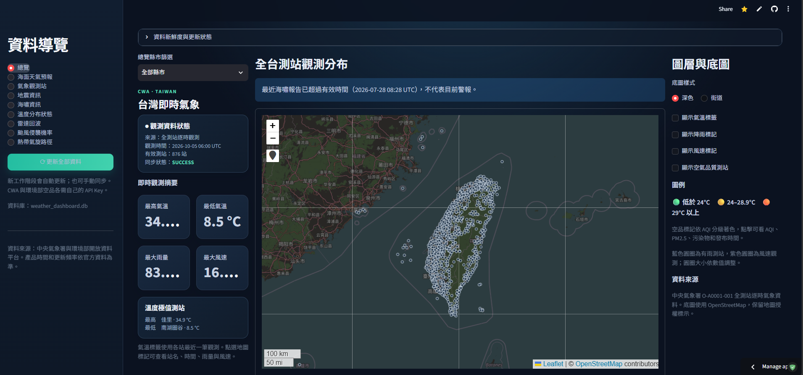
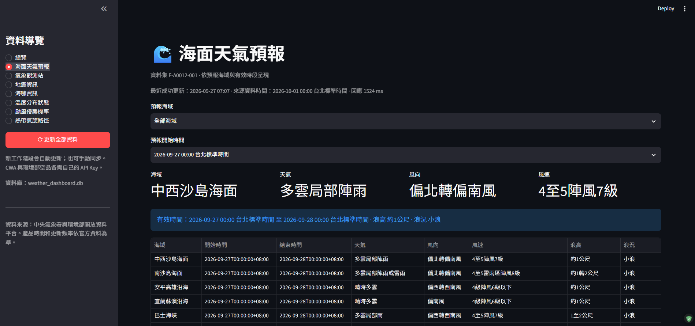
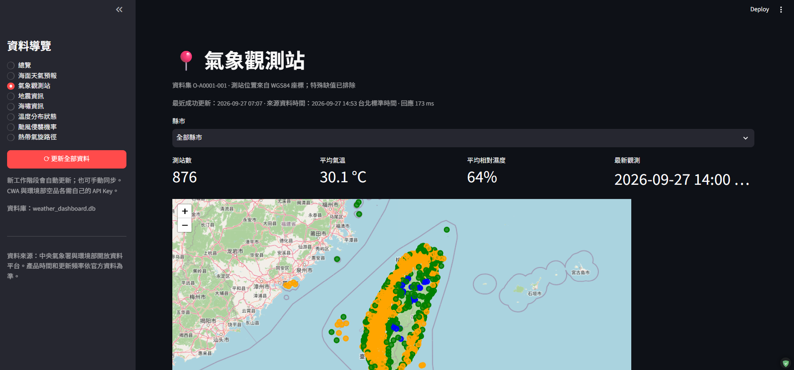
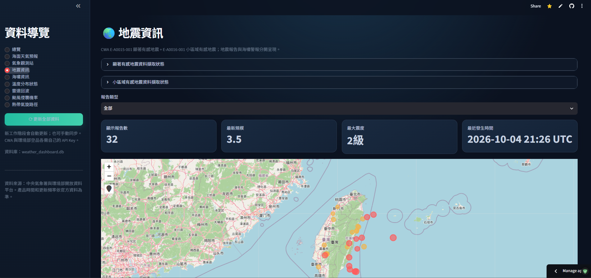
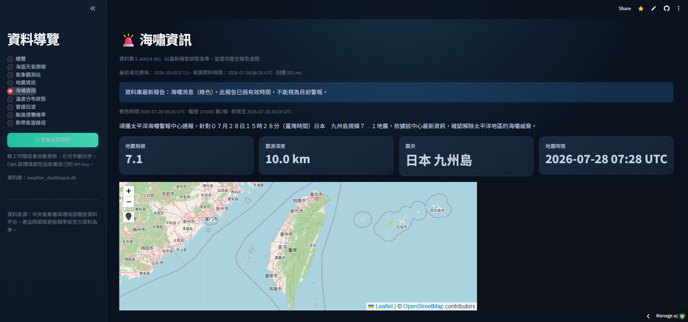
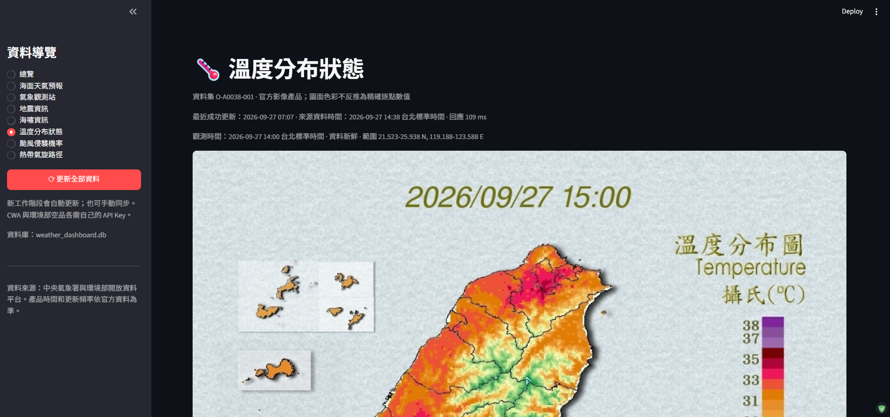
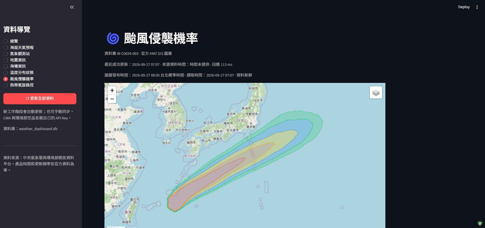
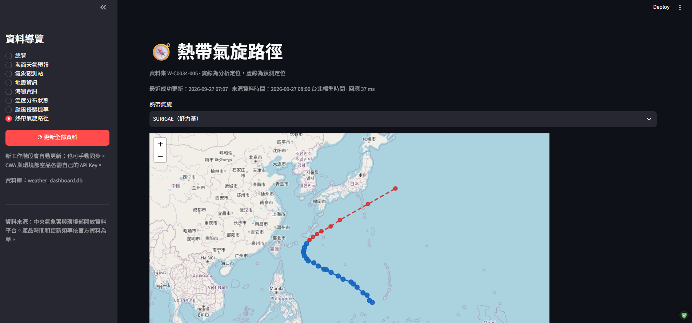

# 台灣海氣象與災害資訊儀表板

以中央氣象署與環境部開放資料建置的 Streamlit + SQLite 儀表板，整合海面天氣、逐時測站觀測、地震/海嘯報告、溫度分布圖、颱風資訊與空氣品質數值地圖。

## 八項 CWA 資料功能

| 頁面 | 資料集 | 功能 |
| --- | --- | --- |
| 海面天氣預報 | `F-A0012-001` | 依海域與時段查詢天氣、風向風速、浪高與浪況。 |
| 氣象觀測站 | `O-A0001-001` | 測站地圖、縣市篩選、氣溫/濕度/風速/雨量趨勢與 CSV。 |
| 地震資訊 | `E-A0015-001`, `E-A0016-001` | 顯著有感與小區域有感地震震央地圖、規模/深度/震度、報告清單與 CSV。 |
| 海嘯資訊 | `E-A0014-001` | 最新報告狀態、震央資訊、歷史報告與 CWA 原始連結。 |
| 溫度分布狀態 | `O-A0038-001` | 顯示 CWA 官方溫度分布影像和資料時間。 |
| 颱風侵襲機率 | `W-C0034-003` | 解析 KMZ/KML 的官方機率多邊形並疊加於地圖。 |
| 熱帶氣旋路徑 | `W-C0034-005` | 在地圖分別呈現過去分析定位與未來預測路徑。 |
| 空氣品質地圖 | `AQX_P_432`（環境部） | 以測站座標呈現 AQI/PM2.5 數值標籤、顏色分級和測站明細，不使用空品圖片。 |

各資料集使用個別解析器與資料表。原始回應保存在 `data/snapshots/`，結構化資料與匯入狀態寫入 SQLite；時間戳記、單位、缺值和空事件狀態會在頁面中保留或明確標示。

總覽頁的「資料新鮮度與更新狀態」可查看八項中央氣象署資料及環境部 AQI 的最近擷取結果、來源資料時間和逾時提示。地震、海嘯與颱風等事件型資料會依事件特性呈現，不會僅因事件時間較早就判為過期。按左側「更新全部資料」重新擷取後可查看最新狀態。

總覽測站地圖預設以台灣本島為中心並採較近的縮放層級，不會為了涵蓋所有站點而自動縮小；可在地圖上自行縮放查看外島及其他測站。

總覽可用縣市篩選同步檢視地圖與摘要，地圖會移至選定縣市；選擇全部縣市時回到台灣本島預設視角。地圖也可按「定位我的裝置」使用瀏覽器位置權限定位（需 localhost/HTTPS 並由使用者允許）。位置只在瀏覽器端定位，不會儲存或傳回伺服器。氣象觀測站頁另有多測站趨勢比較，可比較最多五個測站最近 48 筆觀測資料。

## 畫面導覽

以下畫面展示儀表板總覽與各資料頁的主要呈現方式。

<table>
  <tr>
    <td width="50%" valign="top">
      <br>
      <strong>總覽</strong><br>查看資料同步狀態、全台測站分布與氣象摘要，並調整縣市、底圖和觀測圖層。
    </td>
    <td width="50%" valign="top">
      <br>
      <strong>海面天氣預報</strong><br>依海域與預報時段瀏覽天氣、風向風速、浪高與浪況。
    </td>
  </tr>
  <tr>
    <td width="50%" valign="top">
      <br>
      <strong>氣象觀測站</strong><br>在地圖查看測站位置，並比較氣溫、相對濕度等最新觀測摘要。
    </td>
    <td width="50%" valign="top">
      <br>
      <strong>地震資訊</strong><br>分別檢視顯著有感與小區域地震報告、規模與震央分布。
    </td>
  </tr>
  <tr>
    <td width="50%" valign="top">
      <br>
      <strong>海嘯資訊</strong><br>呈現官方報告狀態、有效時間、地震資訊與震央位置。
    </td>
    <td width="50%" valign="top">
      <br>
      <strong>溫度分布狀態</strong><br>查看中央氣象署溫度分布影像與產品時間；影像不作逐點數值解讀。
    </td>
  </tr>
  <tr>
    <td width="50%" valign="top">
      <br>
      <strong>颱風侵襲機率</strong><br>在地圖呈現官方 KMZ 機率範圍與不同機率級距。
    </td>
    <td width="50%" valign="top">
      <br>
      <strong>熱帶氣旋路徑</strong><br>以不同顏色區分已分析定位與預測路徑，並可選擇熱帶氣旋。
    </td>
  </tr>
</table>

## 安裝與設定

需要 Python 3.9 以上版本。

```powershell
python -m venv .venv
.\.venv\Scripts\Activate.ps1
pip install -r requirements.txt
Copy-Item .env.example .env
```

編輯 `.env` 並分別設定 CWA 與環境部平台的 API Key（不使用某一平台的 Key 呼叫另一平台）：

```ini
CWA_API_KEY=你的CWA授權碼
MOENV_API_KEY=你的環境部API_Key
```

環境部 Key 請在環境部資料開放平台會員帳號中取得。不要提交 `.env` 或分享 API Key；`.env.example` 僅包含佔位字串。

## 匯入資料並啟動

在專案根目錄執行：

```powershell
python -m src.ingest
python -m src.air_quality_ingest
streamlit run app.py
```

可只更新指定資料集：

```powershell
python -m src.ingest --only O-A0001-001 W-C0034-005
```

開啟 Streamlit 顯示的本機網址時，每個新的 Streamlit 工作階段會自動嘗試更新八項 CWA 資料及已設定的環境部空品資料一次；同一工作階段中的元件互動不會重複觸發更新。也可以使用左側「更新全部資料」按鈕手動同步。各資料源需要自己的 API Key 和網路連線；未設定金鑰或更新失敗時會提示使用者，並保留資料庫已儲存的資料和擷取狀態供判讀。

## 專案結構

```text
app.py                         # Streamlit 儀表板
src/config.py                  # 環境變數與本機路徑
src/cwa_client.py              # CWA REST/File API、重試與原始快照
src/moenv_client.py            # 環境部空氣品質 API
src/ingest.py                  # 全部或指定資料集匯入命令
src/air_quality_ingest.py      # AQI 擷取、快照與保存
src/database.py                # SQLite schema、交易與查詢
src/storage.py                 # 資料集解析/儲存分派
src/datasets/                   # CWA 資料集規格與各資料解析器
docs/datasets_spec.md          # 資料集欄位規格
workflow.md                    # 開發與展示工作流程
data/snapshots/                # 原始 API/檔案快照（本機資料）
data/weather_dashboard.db      # SQLite 資料庫（自動建立）
```

## 常見問題

- **缺少 Key**：確認專案根目錄的 `.env` 已設定正確的 `CWA_API_KEY`（及需要時的 `MOENV_API_KEY`）；命令列執行時也可直接設定相同名稱的環境變數。
- **某項匯入失敗**：看終端機的資料集代碼與錯誤訊息；其他資料集會繼續匯入。
- **目前無颱風/海嘯資料**：事件資料無內容可能代表目前無有效事件。請查看資料時間與最近匯入狀態，不要把過期報告解讀成即時警報。
- **地震資訊**：顯著有感及小區域有感報告各自擷取；海嘯資料中的地震欄位不會取代這兩項地震報告。震度圖是官方報告連結，地圖震央只依報告提供的座標繪製。
- **溫度分布圖**：`O-A0038-001` 是官方影像產品，不是可逐點查詢的溫度矩陣。

## 技術

Python、Requests、Pandas、SQLite、Streamlit、Folium、streamlit-folium、python-dotenv。

資料來源：中央氣象署氣象資料開放平台與環境部環境資料開放平台。實際資料欄位、更新頻率和警示效力以各官方公告及資料產品說明為準。
