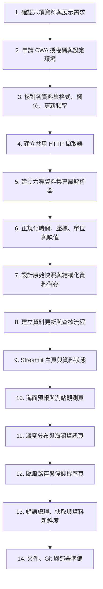

# 台灣海氣象與災害資訊儀表板工作流程

> 本專案整合中央氣象署六項資料，呈現海面預報、測站觀測、海嘯資訊、溫度分布與颱風資訊。各資料集格式與更新頻率不同，因此採用「共用擷取與紀錄機制 + 各資料集專屬解析器 + 分頁展示」；不要把所有資料轉成同一張溫度表。

## 目標資料集與呈現方式

| 儀表板區塊 | 資料集 | 建議呈現 | 資料處理重點 |
| :--- | :--- | :--- | :--- |
| 海面天氣預報 | `F-A0012-001` | 海域/預報時段清單、風向風速與浪高卡片；有座標資料時再上地圖 | 使用 `StartTime`、`EndTime`、`locationName`、`Wx`、`WindDir`、`WindSpeed`、`WaveHeight`、`WaveType`；資料每 6 小時更新。 |
| 氣象觀測站 | `O-A0001-001` | 測站地圖、縣市/測站篩選、逐時氣溫/降雨/風速等觀測圖表 | 以 `StationID` + `ObsTime/DateTime` 定位觀測；保留站名、縣市、座標和測項。特殊值（例如 `-99`、`X`）應視資料說明轉為缺值，勿當成真實測量值。 |
| 海嘯資訊 | `E-A0014-001` | 最新事件/警示狀態、事件時間與說明；無事件時顯示「目前無資料/事件」狀態 | 依最新官方範例解析事件結構；CWA 已公告此資料於 2026-06-01 起有 API 欄位格式異動，解析器需容許欄位版本變化。 |
| 溫度分布狀態 | `O-A0038-001` | 顯示 CWA 溫度分布圖及資料時間；可提供原圖連結 | 此資料集是溫度分布圖產品，不等同於逐站數值表。若要做數值格點分析，應另評估 `O-A0038-003`，本次需求仍以 `O-A0038-001` 呈圖為主。 |
| 颱風侵襲機率 | `W-C0034-003` | 機率資訊/官方圖層與說明；標示資料時間和適用範圍 | 機率是官方路徑預報產品，清楚標示發布時間、預報區間與機率定義；不可解讀成確定會侵襲。 |
| 熱帶氣旋路徑 | `W-C0034-005` | 地圖呈現過去、目前定位與預測路徑，附時間、強度等資訊 | 保留颱風識別/名稱、定位時間、緯經度、預報時間、最大風速等欄位；活動資料依官方產品更新。 |

> `O-A0038-001` 的官方名稱為「溫度分布圖-溫度分布圖」。海面預報、圖檔/圖層或其他 rawData 產品不一定能以一般 JSON 資料列方式讀取。開始實作前，逐一確認資料頁提供的格式與官方 API/檔案下載方式；不要假設六項都能用同一個 REST JSON URL。CWA 提供 RESTful API 與檔案下載介面，使用哪一種依資料集頁面格式決定。

## 全流程導覽



## 階段一：資料與環境確認

### 1. 確認展示需求

- 儀表板以六個分頁/區塊呈現：海面預報、測站觀測、海嘯、溫度分布、侵襲機率、熱帶氣旋路徑。
- 每區塊顯示資料來源、資料時間/更新時間、目前是否有資料，以及單位。
- 先確定要即時讀取或定時擷取後保存。建議先實作手動更新，之後再加排程。

### 2. 取得授權碼並設定環境

建立虛擬環境並安裝 `requirements.txt`。從 CWA 會員中心取得 API 授權碼，放入 `.env`：

```ini
CWA_API_KEY=你的授權碼
```

讀取金鑰前檢查是否存在；不得將 `.env`、下載的私有資料或真實金鑰提交到 Git。保留 `.env.example` 作為設定範例。

### 3. 建立資料集規格清單

每項資料集記錄：`dataset_id`、官方名稱、取得方式（REST API 或 file API/其他格式）、回傳格式、解析入口、更新頻率、時間欄位、座標欄位、單位、缺值代碼、展示元件。格式或欄位以 CWA 最新資料頁和產品文件為準。

## 階段二：擷取、解析與保存

### 4. 共用擷取器

共用程式負責設定 timeout、HTTP 錯誤處理、授權、重試策略、回應格式辨識、擷取時間記錄。以 `requests` 的 `params` 組查詢參數，避免手動拼接 URL。對 API 回應同時檢查 HTTP 狀態與資料本身的錯誤欄位。

### 5. 各資料集專屬解析器

建議模組切分：

```text
src/
├── cwa_client.py          # 授權、HTTP、錯誤與重試
├── datasets/
│   ├── marine_forecast.py # F-A0012-001
│   ├── station_obs.py     # O-A0001-001
│   ├── tsunami.py         # E-A0014-001
│   ├── temperature_map.py # O-A0038-001
│   └── typhoon.py         # W-C0034-003、W-C0034-005
├── storage.py             # 原始快照與標準化資料持久化
└── app.py                 # Streamlit 入口
```

解析器需對欄位缺漏、空資料、日期時區、異常數值與格式變更作出可辨識的錯誤回報。海嘯資料遵照最新格式範例，不依賴單一固定欄位路徑。

### 6. 正規化原則

- 時間保留 ISO 8601 時區資訊，畫面統一轉為台灣時間顯示。
- 儲存原始回應/檔案快照與擷取時間，方便欄位變更時重新解析。
- 數值觀測統一轉型並處理缺值代碼；文字描述保留原始值。
- 座標明確採 WGS84 經緯度；地圖元件收到無效座標時不繪點。
- 使用各資料集的複合識別欄位去重；保留預報發布時間與觀測時間，避免新資料覆寫仍需比較的舊快照。

### 7. 儲存設計

不要使用原本僅有 `TemperatureForecasts(regionName, dataDate, minT, maxT)` 的單表設計。六項資料型態差異大，建議：

1. `ingestion_runs`：資料集代碼、擷取時間、狀態、錯誤摘要。
2. `raw_snapshots`：資料集代碼、發布/觀測時間、原始 JSON 或檔案位置、內容雜湊。
3. 依資料類型建獨立的結構化表（例如 `station_observations`、`marine_forecasts`、`typhoon_positions`、`tsunami_events`）；圖檔型產品保存下載位置、時間與 metadata。

採 SQLite 時避免把大型影像二進位內容塞入一般資料表；可保存於 `data/` 並在資料庫記錄相對路徑。資料庫與下載資料須列入 `.gitignore`。

### 8. 資料查核

每次擷取後記錄成功/失敗、回應時間、資料筆數、資料時間範圍與資料新鮮度。空資料本身不一定是錯誤（例如目前沒有海嘯或颱風事件），介面要區分「目前無事件」與「擷取失敗」。

## 階段三：Streamlit 儀表板

### 9. 主頁與導覽

首頁顯示六項資料的最新更新時間和狀態。各資料集以獨立頁籤或 sidebar 頁面呈現，提供手動重新整理、資料來源連結與錯誤狀態提示。

### 10. 海面預報與測站觀測

- **海面預報**：依預報海域與時段篩選，表格列出天氣、風、浪資訊；地圖座標若未提供或無法可靠對應，就以清單呈現，不使用虛構座標。
- **測站觀測**：以測站地理座標標記地圖，支援縣市/站點選擇；展示氣溫、降雨、風速等逐時趨勢。顯示觀測時間和缺值狀態。

### 11. 溫度分布與海嘯資訊

- **溫度分布**：顯示官方溫度分布圖產品及其時間資訊；不要把圖片色彩直接宣稱為精確數值。若未來要做逐格數據分析，另行改用格點資料集並校正格點座標/單位。
- **海嘯資訊**：展示官方事件狀態、發布時間、事件說明和來源連結。沒有事件時明確顯示目前狀態；遇到未知欄位格式時保留原始紀錄並顯示解析警示。

### 12. 颱風資訊

- **路徑頁**：地圖分別畫出過去/目前定位與預測定位，使用不同線型或圖例；Popup 呈現名稱、定位時間、風速等。
- **侵襲機率頁**：依官方產品欄位呈現數值或圖層，標註發布時間、預報時間範圍和適用區域。避免自行將機率重新解釋為警報或確定性結論。
- 無活動資料時顯示「目前無活動資料」，並標註最後成功更新時間。

### 13. 快取與例外處理

以資料集各自的更新頻率設定快取期限，提供使用者手動刷新。遇到 API 失敗時，可顯示最後一次成功資料及其時間，但要明確標示資料已過期；不可將舊資料標成即時資料。

## 階段四：品質、版本控制與交付

### 14. 驗收項目

- 六項資料集皆能獨立擷取、解析或呈現，失敗不會讓其他區塊一併中斷。
- 畫面標明時間、時區、單位、資料來源與資料新鮮度。
- 無事件、空回應、欄位變更、網路錯誤和缺值都有不同狀態提示。
- 地圖只畫真實座標；圖像產品不冒充可查詢的逐點數值。
- API 金鑰、原始下載資料及本機 DB 不會被提交。

### 15. Git 提交

```bash
git status
git add workflow.md README.md requirements.txt src app.py
git commit -m "feat: add multi-source CWA dashboard workflow"
git push origin main
```

> 提交前確認實際檔案路徑存在，並檢查 staged diff 未包含 `.env`、資料庫、API 回應檔或大型圖檔。

## 官方資料參考

- [CWA 海面天氣預報 `F-A0012-001`](https://opendata.cwa.gov.tw/dataset/all/F-A0012-001)
- [CWA 氣象觀測站全測站逐時資料標準 `O-A0001-001`](https://opendata.cwa.gov.tw/opendatadoc/Observation/O-A0001-001.pdf)
- [CWA 海嘯 API 格式異動公告 `E-A0014-001`](https://opendata.cwa.gov.tw/announcement/news/316?page=1)
- [CWA 溫度分布圖資料標準 `O-A0038-001`](https://opendata.cwa.gov.tw/opendatadoc/Observation/A0038-001.pdf)
- [CWA 天氣警特報資料介紹（含颱風侵襲機率更新說明）](https://opendata.cwa.gov.tw/promotion/introduction/warning)
- [CWA 熱帶氣旋路徑產品說明 `W-C0034-005`](https://opendata.cwa.gov.tw/opendatadoc/Warning/W-C0034-005.pdf)
- [CWA API 使用說明](https://opendata.cwa.gov.tw/devManual/insrtuction)
