# 🗺️ 台灣天氣預報專案開發工作流程 (Development Workflow)

> 本工作流程指南依據「**AI 創新微課程：Taiwan Weather Forecast（從氣象資料到互動式天氣預報應用）**」之 24 個核心實作模組編寫，旨在提供從 0 到 1 完整建置氣象資料收集、SQLite 持久化儲存與 Streamlit + Folium 互動視覺化儀表板的步驟化指引。

---

## 🧭 全流程導覽 (Workflow Overview)

```mermaid
flowchart TD
    subgraph Phase1 ["階段一：資料探索與 API 串接 (步驟 1~5)"]
        S1["1. 課程介紹與環境確立"] --> S2["2. 天氣影響與生活應用分析"]
        S2 --> S3["3. CWA 開放資料平台註冊與金鑰"]
        S3 --> S4["4. Requests 呼叫 API 取得 JSON"]
        S4 --> S5["5. JSON 階層結構探勘與定位"]
    end

    subgraph Phase2 ["階段二：資料清洗與 SQLite 入庫 (步驟 6~10)"]
        S5 --> S6["6. 提取 MinT / MaxT 溫差資料"]
        S6 --> S7["7. Pandas 清洗並轉為結構化 DataFrame"]
        S7 --> S8["8. 建立 SQLite 資料庫 (data.db)"]
        S8 --> S9["9. DDL 設計：TemperatureForecasts 資料表"]
        S9 --> S10["10. 執行 SQL 查詢校驗與去重機制"]
    end

    subgraph Phase3 ["階段三：Streamlit Web App 互動開發 (步驟 11~16)"]
        S10 --> S11["11. Streamlit 核心架構與 Hello World"]
        S11 --> S12["12. pd.read_sql 連線資料庫動態讀取"]
        S12 --> S13["13. Selectbox 下拉選單篩選地區"]
        S13 --> S14["14. 繪製一週最高/最低溫折線圖"]
        S14 --> S15["15. 結構化顯示資料明細表格"]
        S15 --> S16["16. 整合完整 Web App 互動介面"]
    end

    subgraph Phase4 ["階段四：進階台灣地圖視覺化 (步驟 17~19)"]
        S16 --> S17["17. Folium + Streamlit 地圖圖層整合"]
        S17 --> S18["18. 日期篩選器 + 溫度分級著色與 Popup"]
        S18 --> S19["19. 打造 Taiwan Weather Dashboard 綜合儀表板"]
    end

    subgraph Phase5 ["階段五：品質優化、Git 管理與延伸 (步驟 20~24)"]
        S19 --> S20["20. 程式碼分層重構與例外處理"]
        S20 --> S21["21. Git 版本控制與 GitHub 發布"]
        S21 --> S22["22. 延伸思考：Line Bot、AI 旅遊推薦"]
        S22 --> S23["23. 專案核心技術回顧與總結"]
        S23 --> S24["24. 未來下一步：AI × Data 實踐"]
    end
```



---

## 📍 階段一：資料探索與 API 串接 (步驟 1 ~ 5)

### 步驟 1：課程介紹與專案目標確立
- **目標**：掌握 AIoT 專案目標，確立「資料擷取 ➔ 清洗入庫 ➔ 視覺化介面」的三層體系。
- **產出**：建立專案根目錄與基礎設定。

### 步驟 2：台灣天氣與生活關聯分析
- **目標**：確認應用場景需求，釐清氣象數據於日常生活、出遊規劃與智慧農業中的決策價值。
- **關注指標**：未來一週日最高溫（`MaxT`）、最低溫（`MinT`）、降雨機率（`PoP`）與天氣現象（`Wx`）。

### 步驟 3：中央氣象署 CWA Open Data 平台
- **目標**：取得合法公開存取憑證。
- **操作步驟**：
  1. 前往 [CWA 氣象資料開放平臺](https://opendata.cwa.gov.tw/) 註冊帳號。
  2. 登入後於「會員中心」取得個人的 **API 授權碼 (Authorization Code)**。
  3. 選定預報資料集（例如全區一週天氣預報資料集代號 `F-C0032-001` 或鄉鎮天氣預報 `F-D0047-091`）。

### 步驟 4：使用 Requests 取得 API JSON 資料
- **目標**：使用 Python 發起 HTTP 請求，取得即時天氣預報原始資料。
- **關鍵程式碼**：
  ```python
  import requests
  import os
  from dotenv import load_dotenv

  load_dotenv()
  api_key = os.getenv("CWA_API_KEY")
  url = f"https://opendata.cwa.gov.tw/api/v1/rest/datastore/F-C0032-001?Authorization={api_key}&format=JSON"

  response = requests.get(url, timeout=10)
  if response.status_code == 200:
      data = response.json()
      print("API 連線成功！")
  else:
      print(f"連線失敗，狀態碼：{response.status_code}")
  ```

### 步驟 5：JSON 資料結構解析
- **目標**：理清 CWA API 巢狀層級關係，定位目標數據。
- **層級路徑**：
  ```text
  records
   └── location: [
         ├── locationName: "臺北市" / "中部地區"
         └── weatherElement: [
               ├── elementName: "MinT", time: [...]
               ├── elementName: "MaxT", time: [...]
               └── elementName: "Wx",   time: [...]
             ]
       ]
  ```

---

## 📍 階段二：資料整理與 SQLite 資料庫建置 (步驟 6 ~ 10)

### 步驟 6：提取最高與最低氣溫
- **目標**：遍歷 JSON 解析出各地區在不同日期時間區間內的氣溫數值。
- **資料轉換重點**：
  - 將溫度字串轉為浮點數（`float`）。
  - 將開始時間（`startTime`）正規化為日期格式（`YYYY-MM-DD`）。

### 步驟 7：使用 Pandas 清洗整理資料
- **目標**：建構結構化 DataFrame，方便預覽與批次入庫。
- **預期欄位結構**：
  | regionName | dataDate | minT | maxT |
  | :--- | :--- | :--- | :--- |
  | 北部地區 | 2026-04-14 | 18.0 | 26.0 |
  | 中部地區 | 2026-04-14 | 20.0 | 30.0 |
  | 南部地區 | 2026-04-14 | 22.0 | 31.0 |

- **關鍵程式碼**：
  ```python
  import pandas as pd

  records = []
  # 假設已解析出每筆記錄字典
  # records.append({"regionName": "中部地區", "dataDate": "2026-04-14", "minT": 20.0, "maxT": 30.0})
  df = pd.DataFrame(records)
  print(df.head())
  ```

### 步驟 8 & 9：建立 SQLite 資料庫與 Schema 設計
- **目標**：建立本機資料庫 `data.db`，設計具備複合主鍵或唯一約束之 `TemperatureForecasts` 資料表。
- **DDL 綱要**：
  ```sql
  CREATE TABLE IF NOT EXISTS TemperatureForecasts (
      id INTEGER PRIMARY KEY AUTOINCREMENT,
      regionName TEXT NOT NULL,
      dataDate TEXT NOT NULL,
      minT REAL NOT NULL,
      maxT REAL NOT NULL,
      created_at TIMESTAMP DEFAULT CURRENT_TIMESTAMP,
      UNIQUE(regionName, dataDate)
  );
  ```

### 步驟 10：資料寫入與 SQL 驗證
- **目標**：實作**冪等性（Idempotency）寫入**，保證重複執行腳本時不產生重複紀錄，並進行查核。
- **關鍵語法**：
  ```sql
  -- 避免重複插入，若衝突則更新數值
  INSERT INTO TemperatureForecasts (regionName, dataDate, minT, maxT)
  VALUES (?, ?, ?, ?)
  ON CONFLICT(regionName, dataDate) 
  DO UPDATE SET minT=excluded.minT, maxT=excluded.maxT;
  ```
- **驗證查核**：
  ```python
  import sqlite3
  conn = sqlite3.connect("data.db")
  cursor = conn.cursor()
  cursor.execute("SELECT DISTINCT regionName FROM TemperatureForecasts;")
  print("現存分區：", cursor.fetchall())
  ```

---

## 📍 階段三：Streamlit 互動式 Web App 開發 (步驟 11 ~ 16)

### 步驟 11：Streamlit 快速入門
- **目標**：搭建輕量 Web 介面。
- **測試命令**：
  ```bash
  streamlit run app.py
  ```

### 步驟 12：從 SQLite 資料庫動態讀取資料
- **關鍵程式碼**：
  ```python
  import streamlit as st
  import sqlite3
  import pandas as pd

  @st.cache_data(ttl=600)
  def load_data():
      conn = sqlite3.connect("data.db")
      df = pd.read_sql_query("SELECT * FROM TemperatureForecasts ORDER BY dataDate ASC", conn)
      conn.close()
      return df

  df = load_data()
  ```

### 步驟 13：下拉選單切換地區 (Interactive Controls)
- **實作**：
  ```python
  regions = df['regionName'].unique()
  selected_region = st.selectbox("請選擇預報地區：", regions)
  filtered_df = df[df['regionName'] == selected_region]
  ```

### 步驟 14 & 15：繪製一週溫差折線圖與資料表格
- **實作**：
  ```python
  st.subheader(f"📊 {selected_region} - 一週最高與最低氣溫走勢")
  chart_data = filtered_df.set_index("dataDate")[["minT", "maxT"]]
  st.line_chart(chart_data)

  st.subheader("📋 氣溫預報詳細數據")
  st.dataframe(filtered_df[["dataDate", "minT", "maxT"]].reset_index(drop=True), use_container_width=True)
  ```

### 步驟 16：整合完整 Web 介面
- 結合 `st.sidebar` 擺放參數控制項，使用 `st.metric` 顯示今日最高/最低溫與平均溫差，提供清晰之 Dashboard 佈局。

---

## 📍 階段四：進階台灣地圖視覺化 (步驟 17 ~ 19)

### 步驟 17：使用 Folium 繪製台灣地圖
- **目標**：在 Streamlit 中嵌入具備地理資訊的互動地圖。
- **技術套件**：`folium`, `streamlit_folium.st_folium`。

### 步驟 18：日期切換與溫度顏色級距
- **溫度顏色對照表**：
  - `< 20°C` ➔ 🔵 偏冷（藍色 `#3498db`）
  - `20 ~ 25°C` ➔ 🟢 舒適（綠色 `#2ecc71`）
  - `25 ~ 30°C` ➔ 🟡 溫熱（黃色/橙色 `#f39c12`）
  - `> 30°C` ➔ 🔴 炎熱（紅色 `#e74c3c`）

- **地圖標記範例**：
  ```python
  import folium
  from streamlit_folium import st_folium

  # 台灣中心座標
  m = folium.Map(location=[23.973875, 120.982024], zoom_start=7, tiles="CartoDB positron")

  # 根據選定日期的平均溫度標記各地區
  for _, row in day_df.iterrows():
      avg_temp = (row['minT'] + row['maxT']) / 2
      color = "blue" if avg_temp < 20 else ("green" if avg_temp <= 25 else ("orange" if avg_temp <= 30 else "red"))
      coords = REGION_COORDS.get(row['regionName'], [23.5, 121.0])
      folium.CircleMarker(
          location=coords,
          radius=12,
          popup=f"<b>{row['regionName']}</b><br>最低溫: {row['minT']}°C<br>最高溫: {row['maxT']}°C",
          color=color,
          fill=True,
          fill_opacity=0.7
      ).add_to(m)

  st_folium(m, width=700, height=500)
  ```

### 步驟 19：Taiwan Weather Dashboard 成果展示
- 將折線圖、表格、統計指標與台灣地圖組裝為完整的全功能儀表板。

---

## 📍 階段五：程式碼品質優化、Git 管理與未來展望 (步驟 20 ~ 24)

### 步驟 20：程式碼品質與架構優化
- [x] **模組分工**：將 API 擷取、資料庫邏輯、地圖工具分拆為不同 `.py` 檔案。
- [x] **例外防護**：加裝 `try...except`，針對網絡斷線、API 回傳無效 JSON 等做容錯處理。
- [x] **快取優化**：善用 `@st.cache_data` 降低重複讀取資料庫的開銷。

### 步驟 21：專案版本控制與 GitHub 託管
```bash
# 初始化並確認變更
git status

# 加入版本管理並提交
git add .
git commit -m "feat: complete Taiwan weather forecast dashboard with folium map"

# 推送至遠端 GitHub 儲存庫
git push origin main
```

### 步驟 22：延伸應用與創新想法
- **Line Bot 智慧天氣小幫手**：串接 Line Messaging API，每天早晨發送穿衣降雨警報。
- **AI 旅遊行程推薦助理**：結合 LLM 模型，依據預測天氣推薦戶外或室內景點。
- **農業與防災自動告警**：低溫特報、強降雨即時 Email / SMS 通知。

### 步驟 23 & 24：回顧、總結與下一步
- 複習核心技術鏈：`API` ➔ `JSON` ➔ `Pandas` ➔ `SQLite` ➔ `Streamlit` ➔ `Folium`。
- 持續探索政府資料開放平台更多開放 API，打造更完整的 AIoT 數據應用作品！
