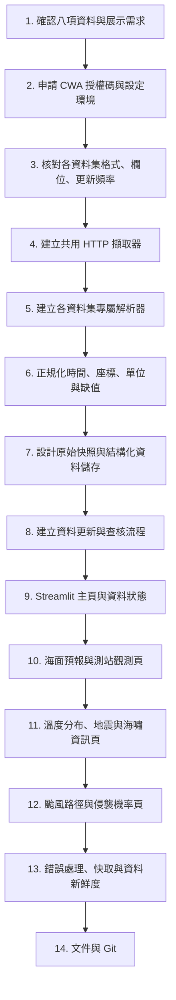

# 台灣海氣象與災害資訊儀表板工作流程

> 本專案整合中央氣象署八項資料，呈現海面預報、測站觀測、地震與海嘯資訊、溫度分布與颱風資訊。各資料集格式與更新頻率不同，因此採用「共用擷取與紀錄機制 + 各資料集專屬解析器 + 分頁展示」；不要把所有資料轉成同一張溫度表。

## 目標資料集與呈現方式

| 儀表板區塊 | 資料集 | 建議呈現 | 資料處理重點 |
| :--- | :--- | :--- | :--- |
| 海面天氣預報 | `F-A0012-001` | 海域/預報時段清單、風向風速與浪高卡片；有座標資料時再上地圖 | 使用 `StartTime`、`EndTime`、`locationName`、`Wx`、`WindDir`、`WindSpeed`、`WaveHeight`、`WaveType`；資料每 6 小時更新。 |
| 氣象觀測站 | `O-A0001-001` | 測站地圖、縣市/測站篩選、逐時氣溫/降雨/風速等觀測圖表 | 以 `StationID` + `ObsTime/DateTime` 定位觀測；保留站名、縣市、座標和測項。特殊值（例如 `-99`、`X`）應視資料說明轉為缺值，勿當成真實測量值。 |
| 海嘯資訊 | `E-A0014-001` | 最新事件/警示狀態、事件時間與說明；無事件時顯示「目前無資料/事件」狀態 | 依最新官方範例解析事件結構；CWA 已公告此資料於 2026-06-01 起有 API 欄位格式異動，解析器需容許欄位版本變化。 |
| 地震資訊 | `E-A0015-001`、`E-A0016-001` | 同一地震頁分別篩選顯著有感與小區域有感報告；地圖標示震央，清單列規模、深度、震度及官方報告/震度圖 | 事件型 REST JSON；以 `EarthquakeInfo`、`Epicenter`、`EarthquakeMagnitude`、`Intensity` 等欄位正規化，接受欄位大小寫/單筆結構差異；2026-06-01 起的新格式需兼容。此資料獨立於海嘯警報。 |
| 溫度分布狀態 | `O-A0038-001` | 顯示 CWA 溫度分布圖及資料時間；可提供原圖連結 | 此資料集是溫度分布圖產品，不等同於逐站數值表。若要做數值格點分析，應另評估 `O-A0038-003`，本次需求仍以 `O-A0038-001` 呈圖為主。 |
| 颱風侵襲機率 | `W-C0034-003` | 機率資訊/官方圖層與說明；標示資料時間和適用範圍 | 機率是官方路徑預報產品，清楚標示發布時間、預報區間與機率定義；不可解讀成確定會侵襲。 |
| 熱帶氣旋路徑 | `W-C0034-005` | 地圖呈現過去、目前定位與預測路徑，附時間、強度等資訊 | 保留颱風識別/名稱、定位時間、緯經度、預報時間、最大風速等欄位；活動資料依官方產品更新。 |

> `O-A0038-001` 的官方名稱為「溫度分布圖-溫度分布圖」。海面預報、圖檔/圖層或其他 rawData 產品不一定能以一般 JSON 資料列方式讀取。開始實作前，逐一確認資料頁提供的格式與官方 API/檔案下載方式；不要假設各資料集都能用同一個 REST JSON URL。CWA 提供 RESTful API 與檔案下載介面，使用哪一種依資料集頁面格式決定。

## 全流程導覽


```mermaid
flowchart TD
    A[1. 確認八項資料與展示需求] --> B[2. 申請 CWA 授權碼與設定環境]
    B --> C[3. 核對各資料集格式、欄位、更新頻率]
    C --> D[4. 建立共用 HTTP 擷取器]
    D --> E[5. 建立各資料集專屬解析器]
    E --> F[6. 正規化時間、座標、單位與缺值]
    F --> G[7. 設計原始快照與結構化資料儲存]
    G --> H[8. 建立資料更新與查核流程]
    H --> I[9. Streamlit 主頁與資料狀態]
    I --> J[10. 海面預報與測站觀測頁]
    J --> K[11. 溫度分布、地震與海嘯資訊頁]
    K --> L[12. 颱風路徑與侵襲機率頁]
    L --> M[13. 錯誤處理、快取與資料新鮮度]
    M --> N[14. 文件與 Git]
```

## 階段一：資料與環境確認

### 1. 確認展示需求

- 儀表板呈現海面預報、測站觀測、地震、海嘯、溫度分布、侵襲機率、熱帶氣旋路徑等區塊。
- 每區塊顯示資料來源、資料時間/更新時間、目前是否有資料，以及單位。
- 先確定要即時讀取或定時擷取後保存。建議先實作手動更新，之後再加排程。

### 2. 取得授權碼並設定環境

建立虛擬環境並安裝 `requirements.txt`。從 CWA 會員中心取得 API 授權碼，放入 `.env`：

```ini
CWA_API_KEY=你的授權碼
```

程式從環境變數、專案根目錄本機 `.env` 或 Streamlit Community Cloud Secrets 讀取設定；兩家資料來源的 Key 分開設定。讀取金鑰前檢查是否存在；不得將 `.env`、下載的私有資料或真實金鑰提交到 Git。Cloud Secrets 使用 TOML 格式：

```toml
CWA_API_KEY = "你的CWA授權碼"
MOENV_API_KEY = "你的環境部API_Key"
```

保留 `.env.example` 作為本機設定範例。

### 3. 建立資料集規格清單

每項資料集記錄：`dataset_id`、官方名稱、取得方式（REST API 或 file API/其他格式）、回傳格式、解析入口、更新頻率、時間欄位、座標欄位、單位、缺值代碼、展示元件。格式或欄位以 CWA 最新資料頁和產品文件為準。

## 階段二：擷取、解析與保存

### 4. 共用擷取器

共用程式負責設定 timeout、HTTP 錯誤處理、授權、重試策略、回應格式辨識、擷取時間記錄。以 `requests` 的 `params` 組查詢參數，避免手動拼接 URL。對 API 回應同時檢查 HTTP 狀態與資料本身的錯誤欄位。一般請求 timeout 設為 8 秒、最多重試 1 次；連線錯誤需提供例外類型與已遮罩的診斷細節，任何錯誤都不得包含授權 query、API Key 或完整敏感 URL。CWA TLS/SSL 連線診斷最多保留 700 字元，以顯示完整憑證驗證原因；遮罩必須先於截短執行。

若 CWA 憑證鏈因缺少 Subject Key Identifier 而被 Python 3.13+ 的嚴格 X.509 驗證拒絕，可使用獨立的 CWA HTTP adapter 僅清除 `VERIFY_X509_STRICT` 旗標。必須繼續使用 certifi 信任庫、`CERT_REQUIRED` 和 hostname check；不得以 `verify=False` 或關閉憑證驗證代替。此相容設定限定在 `opendata.cwa.gov.tw`，並應在 CWA 修復憑證鏈後移除。

### 5. 各資料集專屬解析器

建議模組切分：

```text
src/
├── cwa_client.py          # 授權、HTTP、錯誤與重試
├── datasets/
│   ├── marine_forecast.py # F-A0012-001
│   ├── station_obs.py     # O-A0001-001
│   ├── tsunami.py         # E-A0014-001
│   ├── earthquake.py      # E-A0015-001、E-A0016-001
│   ├── temperature_map.py # O-A0038-001
│   └── typhoon.py         # W-C0034-003、W-C0034-005
├── storage.py             # 原始快照與標準化資料持久化
└── app.py                 # Streamlit 入口
```

解析器需對欄位缺漏、空資料、日期時區、異常數值與格式變更作出可辨識的錯誤回報。海嘯資料遵照最新格式範例，不依賴單一固定欄位路徑。

### 6. 正規化原則

- 時間保留 ISO 8601 時區資訊，畫面統一轉為台灣時間顯示。
- 儲存原始回應/檔案快照與擷取時間，方便欄位變更時重新解析。
- 數值觀測統一轉型並處理缺值代碼；文字描述保留原始值。
- 座標明確採 WGS84 經緯度；地圖元件收到無效座標時不繪點。
- 使用各資料集的複合識別欄位去重；保留預報發布時間與觀測時間，避免新資料覆寫仍需比較的舊快照。

### 7. 儲存設計

不要使用原本僅有 `TemperatureForecasts(regionName, dataDate, minT, maxT)` 的單表設計。各項資料型態差異大，建議：

1. `ingestion_runs`：資料集代碼、擷取時間、狀態、錯誤摘要。
2. `raw_snapshots`：資料集代碼、發布/觀測時間、原始 JSON 或檔案位置、內容雜湊。
3. 依資料類型建獨立的結構化表（例如 `station_observations`、`marine_forecasts`、`typhoon_positions`、`tsunami_events`）；圖檔型產品保存下載位置、時間與 metadata。

採 SQLite 時避免把大型影像二進位內容塞入一般資料表；可保存於 `data/` 並在資料庫記錄相對路徑。資料庫與下載資料須列入 `.gitignore`。

### 8. 資料查核

每次擷取後記錄成功/失敗、回應時間、資料筆數、資料時間範圍與資料新鮮度。空資料本身不一定是錯誤（例如目前沒有海嘯或颱風事件），介面要區分「目前無事件」與「擷取失敗」。

## 階段三：Streamlit 儀表板

### 9. 主頁與導覽

首頁顯示各資料集的最新更新時間和狀態。各資料集以獨立頁籤或 sidebar 頁面呈現，提供手動重新整理、資料來源連結與錯誤狀態提示。

全站共用深色視覺主題：以深藍底色、青綠操作色、柔和漸層與細邊框建立層次；統一主標題、指標卡、表格、圖表、輸入控制、展開區塊、提示框與按鈕樣式。共用主題須套用在總覽和所有資料頁，並保留小螢幕下標題與內容的可讀性。互動元件提供明確 hover 回饋，不改變資料意義或操作流程。

目前總覽頁採三欄式配置：左側顯示觀測狀態和即時摘要，中間顯示海嘯提醒及測站地圖，右側提供底圖與氣象圖層控制。標題使用 Streamlit 原生標題元件，避免自訂 HTML 標題被版面裁切。更新全部資料的入口只保留在左側導覽列；地圖內不再放置重複的底圖/圖層控制，統一由右側面板操作。未啟用的測站圖層不建立，地圖互動結果不回傳 Streamlit，以減少地圖資料量與不必要的整頁重繪。

總覽另提供可展開的「資料新鮮度與更新狀態」表，列出八項 CWA 資料集及環境部 AQI 資料的最近擷取狀態、擷取時間及來源資料時間。固定週期資料依更新間隔設定逾時門檻（容許兩倍更新週期）；地震、海嘯與颱風資料為事件型，舊事件時間不直接判為逾期。此狀態反映最近一次擷取紀錄，重新擷取仍由左側「更新全部資料」觸發；失敗或來源無可呈現資料須與資料過期分開顯示。

總覽測站地圖初始中心固定在台灣本島（約 23.7°N, 121.0°E），初始縮放層級為 7；不依全部站點座標自動縮放，以免離島或遠距座標令台灣本島縮得過小。使用者仍可手動縮放查看其他測站。

總覽提供縣市篩選，所選縣市會同步套用到地圖、測站數及氣象摘要，地圖並以該縣市測站座標置中；選擇全部縣市時恢復台灣本島預設視角。地圖另提供「定位我的裝置」控制；只有使用者按下按鈕後才呼叫瀏覽器 Geolocation API，拒絕權限或無法定位時顯示原因。裝置座標只在地圖瀏覽器端使用，不送入資料庫或 CWA API；定位功能需要 localhost 或 HTTPS 安全來源及使用者授權。

Streamlit 全寬元件使用 `width="stretch"`，不要再使用已棄用的 `use_container_width`。Folium 定位控制的 CSS/JavaScript 內嵌於 Python f-string 時，CSS 大括號必須跳脫成雙大括號，避免被 Python 誤當成插值運算式。

每個新的 Streamlit 工作階段啟動時自動嘗試同步八項 CWA 資料及已設定的環境部 AQI 資料一次；以 session state 防止元件互動/rerun 重複同步。自動同步與手動更新共用 `_sync_all()`，必須在完成或失敗後清除資料快取，使頁面重新讀取資料庫；缺少 API Key 時提示設定要求並顯示現有資料。CWA 同一輪同步若遇到連線錯誤，記錄安全診斷並快速略過同一服務主機的後續請求，避免多個資料集重複等待逾時。Streamlit Community Cloud 使用 App settings → Secrets 儲存 TOML 格式金鑰；`src/config.py` 優先讀取 `st.secrets`，再回退到本機環境變數/`.env`，避免舊環境變數遮蔽 app Secrets。CWA 與環境部 HTTPS 相容設定都限定於各自 API 主機，使用 certifi CA，保留 CA 鏈與主機名稱驗證，只放寬嚴格 X.509 格式檢查；不得使用 `verify=False`。`.streamlit/config.toml` 將 `server.fileWatcherType` 設為 `poll`，避開 Cloud Linux inotify 配額，同時保留開發時自動重載；`.streamlit/secrets.toml` 不提交。Cloud 執行環境的 SQLite 與快照只作暫存快取，重新啟動/部署後不保證保存；主內容頂端留出 4rem 空間，避免第一列控制項被 Streamlit 工具列遮擋。

空氣品質另接環境部 `AQX_P_432` 每小時 AQI 測站資料，使用獨立的 `MOENV_API_KEY`。擷取目前 AQI、PM2.5、測站名稱、縣市、發布時間及座標，寫入 `air_quality_observations`；匯入時須將 ISO、`YYYY/MM/DD HH:MM[:SS]` 等來源時間格式正規化為含時區的 ISO 時間，以便新鮮度狀態正確判讀。總覽地圖提供 AQI/PM2.5 數值標記切換，標記顏色依官方 AQI 級距著色，彈窗保留主要污染物、狀態與發布時間。空品圖層須遵循縣市篩選，不用氣象站資料或影像推算污染值。

資料表查詢為空時，測站與空品查詢函式仍須回傳具備預期欄位的空 DataFrame；總覽要顯示無資料狀態與檢查 API Key/更新狀態的提示，不能因空結果而以欄位缺漏造成 `KeyError`。沒有測站座標時，地圖顯示可理解的空狀態，不阻止摘要與其他區塊呈現。

### 10. 海面預報與測站觀測

- **海面預報**：依預報海域與時段篩選，表格列出天氣、風、浪資訊；地圖座標若未提供或無法可靠對應，就以清單呈現，不使用虛構座標。
- **測站觀測**：以測站地理座標標記地圖，支援縣市/站點選擇；展示氣溫、降雨、風速等逐時趨勢。顯示觀測時間和缺值狀態。
- 測站頁保留單站趨勢，並提供多測站趨勢比較：可選擇最多五站與一項觀測指標，比較各站最近 48 筆資料；不同測站的觀測時間不一致時保留缺值，不插補或偽造資料。

### 11. 溫度分布與海嘯資訊

- **溫度分布**：顯示官方溫度分布圖產品及其時間資訊；不要把圖片色彩直接宣稱為精確數值。若未來要做逐格數據分析，另行改用格點資料集並校正格點座標/單位。
- **海嘯資訊**：展示官方事件狀態、發布時間、事件說明和來源連結。沒有事件時明確顯示目前狀態；遇到未知欄位格式時保留原始紀錄並顯示解析警示。
- **地震資訊**：分別擷取 `E-A0015-001` 顯著有感與 `E-A0016-001` 小區域有感報告，在地震頁提供來源篩選、震央地圖、規模/深度/震度摘要、報告清單和 CSV。只有來源提供有效震央座標時才落點；小區域及顯著有感資料各自保留來源識別，不合併或去重成同一事件。海嘯資料中的地震欄位僅供海嘯報告說明，不取代地震報告。

### 12. 颱風資訊

- **路徑頁**：地圖分別畫出過去/目前定位與預測定位，使用不同線型或圖例；Popup 呈現名稱、定位時間、風速等。
- **侵襲機率頁**：依官方產品欄位呈現數值或圖層，標註發布時間、預報時間範圍和適用區域。避免自行將機率重新解釋為警報或確定性結論。
- 無活動資料時顯示「目前無活動資料」，並標註最後成功更新時間。

### 13. 快取與例外處理

以資料集各自的更新頻率設定快取期限，提供使用者手動刷新。遇到 API 失敗時，可顯示最後一次成功資料及其時間，但要明確標示資料已過期；不可將舊資料標成即時資料。連線錯誤訊息須保留例外類型與安全的主機/原因文字，先遮罩完整 URL query 與常見金鑰參數，再寫入資料庫或顯示在介面。Community Cloud 問題可從 app 右下角 **Manage app → Cloud logs** 讀取；確認部署安裝完成，再依資料頁錯誤區分 HTTP 狀態、連線逾時、DNS/TLS 或其他連線錯誤。若多筆 CWA 資料同時發生同一主機連線錯誤，同一輪同步只需對 CWA 主機實際等待一次，其餘資料集應快速記錄相同連線失敗，避免逐筆重複逾時。

## 階段四：品質、版本控制與交付

### 14. 驗收項目

- 八項 CWA 資料集皆能獨立擷取、解析或呈現，失敗不會讓其他區塊一併中斷。
- 畫面標明時間、時區、單位、資料來源與資料新鮮度。
- 無事件、空回應、欄位變更、網路錯誤和缺值都有不同狀態提示。
- 地圖只畫真實座標；圖像產品不冒充可查詢的逐點數值。
- API 金鑰、原始下載資料及本機 DB 不會被提交。

### 15. Git 提交

```bash
git status
git add .gitignore .streamlit workflow.md README.md requirements.txt src app.py
git commit -m "feat: add multi-source CWA dashboard workflow"
git push origin main
```

> 提交前確認實際檔案路徑存在，並檢查 staged diff 未包含 `.env`、資料庫、API 回應檔或大型圖檔。

## 官方資料參考

- [CWA 海面天氣預報 `F-A0012-001`](https://opendata.cwa.gov.tw/dataset/all/F-A0012-001)
- [CWA 氣象觀測站全測站逐時資料標準 `O-A0001-001`](https://opendata.cwa.gov.tw/opendatadoc/Observation/O-A0001-001.pdf)
- [CWA 海嘯 API 格式異動公告 `E-A0014-001`](https://opendata.cwa.gov.tw/announcement/news/316?page=1)
- [CWA 地震/海嘯 API 格式異動公告 `E-A0015-001`、`E-A0016-001`](https://opendata.cwa.gov.tw/announcement/news/316?page=1)
- [CWA 顯著有感地震報告說明 `E-A0015-001`](https://opendata.cwa.gov.tw/opendatadoc/Earthquake/E-A0015-001.pdf)
- [CWA 小區域有感地震報告說明 `E-A0016-001`](https://opendata.cwa.gov.tw/opendatadoc/Earthquake/E-A0016-001.pdf)
- [CWA 溫度分布圖資料標準 `O-A0038-001`](https://opendata.cwa.gov.tw/opendatadoc/Observation/A0038-001.pdf)
- [CWA 天氣警特報資料介紹（含颱風侵襲機率更新說明）](https://opendata.cwa.gov.tw/promotion/introduction/warning)
- [CWA 熱帶氣旋路徑產品說明 `W-C0034-005`](https://opendata.cwa.gov.tw/opendatadoc/Warning/W-C0034-005.pdf)
- [CWA API 使用說明](https://opendata.cwa.gov.tw/devManual/insrtuction)
